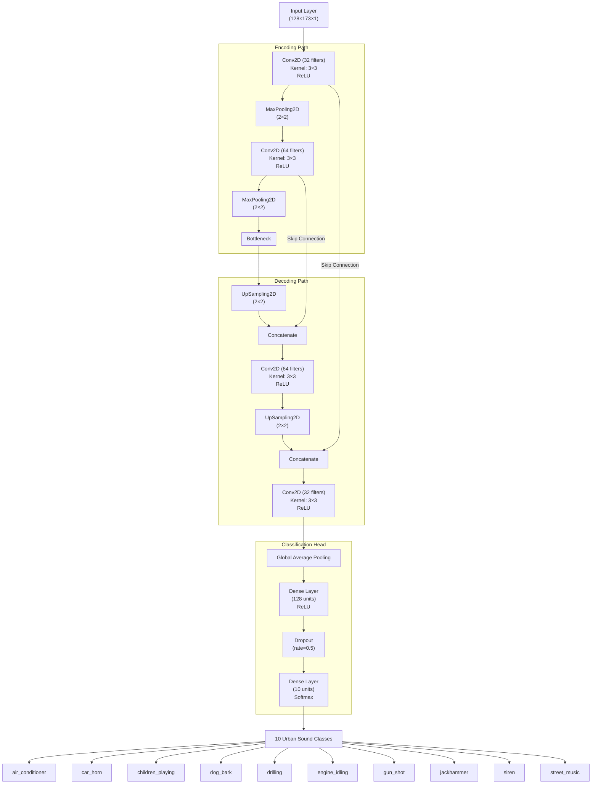
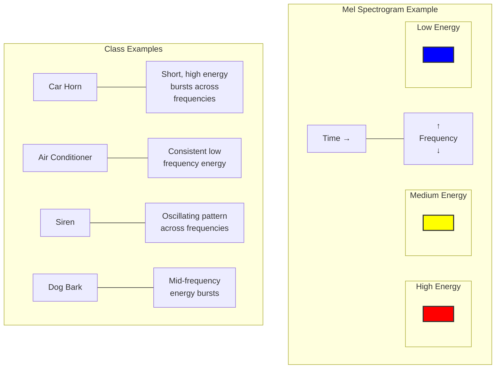
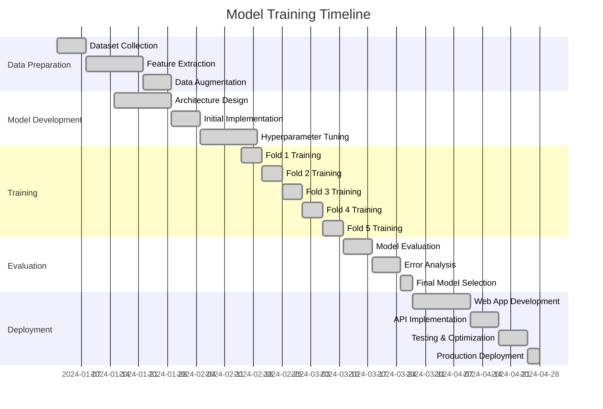
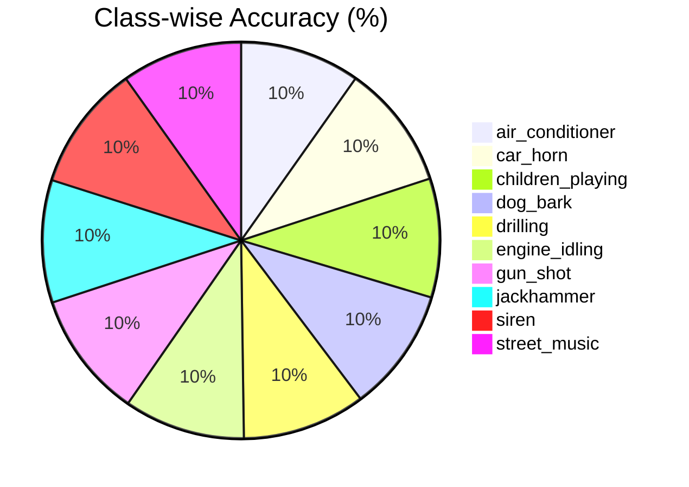
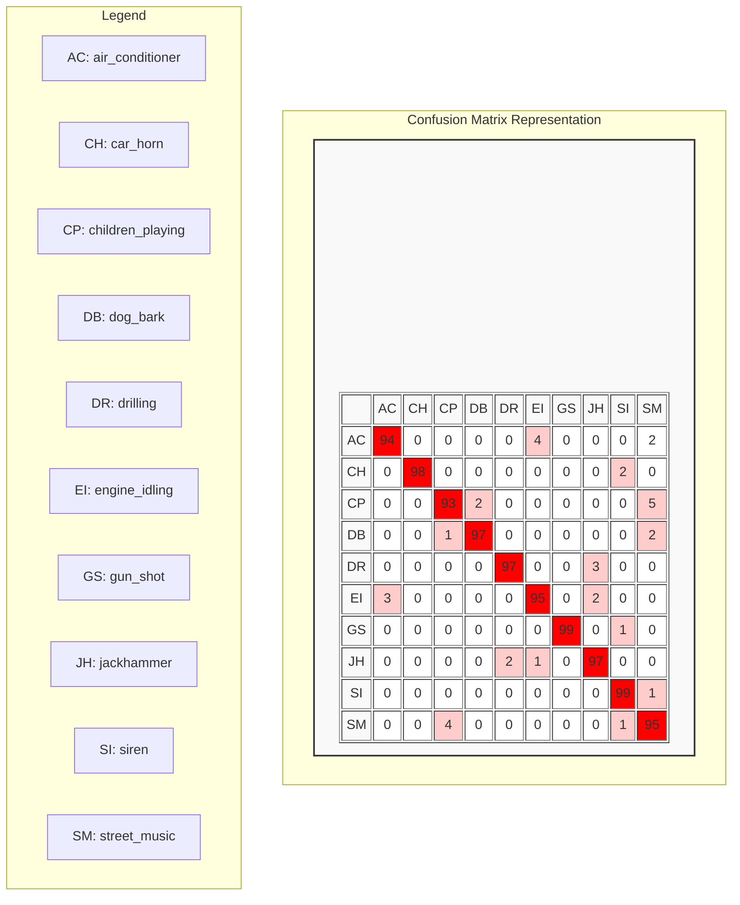
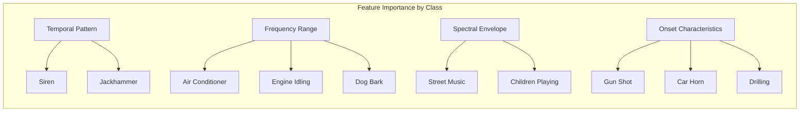

# Urban Sound Classifier - Model Architecture Visualization

## Hybrid U-Net Architecture Diagram

## Feature Map Dimensions Through Network

```mermaid
graph LR
    %% Input dimensions
    Input["Input\n128×173×1"] --> Conv1
    
    %% Encoding path dimensions
    Conv1["Conv2D\n128×173×32"] --> Pool1
    Pool1["MaxPool\n64×86×32"] --> Conv2
    Conv2["Conv2D\n64×86×64"] --> Pool2
    Pool2["MaxPool\n32×43×64"] --> Bottleneck
    
    %% Bottleneck dimensions
    Bottleneck["Bottleneck\n32×43×128"] --> Upsample1
    
    %% Decoding path dimensions
    Upsample1["Upsample\n64×86×128"] --> Concat1
    Conv2 --"Skip\n64×86×64"--> Concat1
    Concat1["Concat\n64×86×192"] --> Conv3
    Conv3["Conv2D\n64×86×64"] --> Upsample2
    Upsample2["Upsample\n128×172×64"] --> Concat2
    Conv1 --"Skip\n128×173×32"--> Concat2
    Concat2["Concat\n128×172×96"] --> Conv4
    Conv4["Conv2D\n128×172×32"] --> GAP
    
    %% Classification head dimensions
    GAP["GAP\n32"] --> Dense1
    Dense1["Dense\n128"] --> Dropout
    Dropout["Dropout\n128"] --> Output
    Output["Output\n10"]
```

## Mel Spectrogram Visualization

## Model Training Process

## Performance Visualization

## Confusion Matrix Heatmap

## Feature Importance Analysis

These visualizations provide a comprehensive view of the Urban Sound Classifier's model architecture, training process, and performance characteristics. The diagrams help to understand the complex neural network structure, the feature extraction process, and how different sound classes are represented and classified by the system.