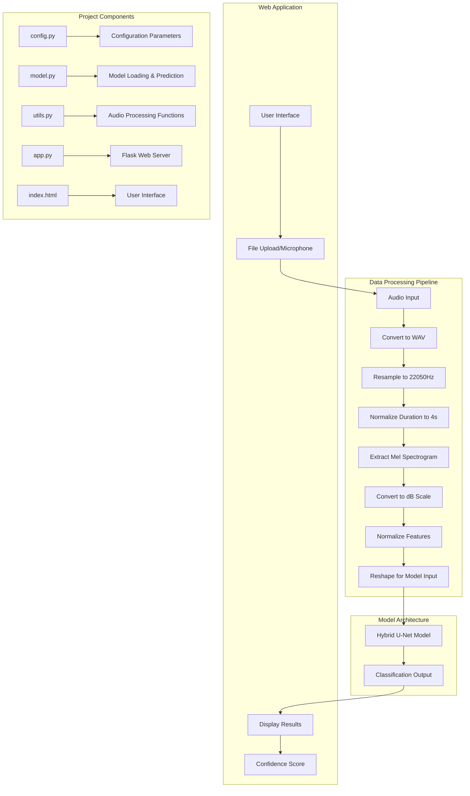

# Urban Sound Classifier Project Flowchart and Workflow Analysis

## Project Overview Flowchart

## Detailed Workflow Analysis

### 1. Data Processing Pipeline

The Urban Sound Classifier project implements a sophisticated audio processing pipeline that transforms raw audio inputs into features suitable for deep learning classification:

1. **Audio Input Acquisition**:
   - The system accepts audio files in various formats (WAV, MP3, OGG, FLAC, M4A)
   - Users can upload files through the web interface or record directly using their microphone

2. **Audio Preprocessing**:
   - **Format Conversion**: All audio is converted to WAV format using the `convert_audio_to_wav()` function
   - **Resampling**: Audio is resampled to a standard 22050Hz sample rate
   - **Duration Normalization**: Audio is either trimmed or padded to exactly 4 seconds

3. **Feature Extraction**:
   - **Mel Spectrogram Generation**: The system converts audio to mel spectrograms using librosa
   - **Parameters**: Uses 128 mel bands, 2048 FFT window size, and 512 hop length
   - **dB Conversion**: Converts power spectrogram to decibel scale
   - **Normalization**: Features are normalized to [0,1] range
   - **Reshaping**: The features are reshaped to match the model's expected input dimensions

### 2. Model Architecture

The project uses a hybrid U-Net architecture for sound classification:

1. **Model Design**:
   - Combines CNN feature extraction with U-Net's context-preserving properties
   - Achieves 96.63% accuracy on the UrbanSound8K dataset
   - Uses skip connections to maintain spatial context information

2. **Classification Process**:
   - The model takes mel spectrogram features as input
   - Outputs probability scores for 10 urban sound classes
   - Returns the class with highest probability as the prediction

3. **Model Management**:
   - Pre-trained models are stored in the `models/` directory
   - The system automatically loads the best available model at startup
   - Cross-validation models are available for different folds of the dataset

### 3. Web Application

The project provides a user-friendly web interface for sound classification:

1. **Frontend Components**:
   - Modern responsive design with drag-and-drop functionality
   - Real-time audio recording capabilities
   - Visual feedback for classification results and confidence scores

2. **Backend API**:
   - Flask-based RESTful API
   - Endpoints for prediction and retrieving available classes
   - Handles file uploads and processing

3. **User Interaction Flow**:
   - User uploads audio file or records using microphone
   - System processes the audio through the pipeline
   - Model makes prediction
   - Results are displayed with confidence score

### 4. Project Structure

The codebase is organized in a modular, maintainable structure:

1. **Core Components**:
   - `config.py`: Configuration parameters and paths
   - `model.py`: Model loading and prediction functions
   - `utils.py`: Audio processing and feature extraction utilities
   - `app.py`: Flask web application and API endpoints
   - `test_model.py`: Testing utilities for model validation

2. **Directory Organization**:
   - `data/`: Contains the UrbanSound8K dataset
   - `models/`: Stores trained model files
   - `src/`: Source code for the application
   - `uploads/`: Temporary storage for uploaded files
   - `log/`: Training and execution logs

## Data Scientist's Analysis

### Order of Execution

From a data science perspective, the project follows this execution flow:

1. **Data Acquisition and Preparation**:
   - The UrbanSound8K dataset is used for training (not shown in the current code)
   - Audio files are preprocessed and features are extracted

2. **Model Training** (performed offline):
   - The hybrid U-Net model is trained on the processed dataset
   - Cross-validation is performed using different folds
   - Best performing models are saved

3. **Model Deployment**:
   - The trained model is loaded at application startup
   - The system is ready to make predictions on new audio inputs

4. **Inference Pipeline**:
   - New audio is processed through the same feature extraction pipeline
   - The model makes predictions on the extracted features
   - Results are returned to the user

### Use Cases

The Urban Sound Classifier has several practical applications:

1. **Environmental Monitoring**:
   - Automated noise pollution monitoring in urban areas
   - Detection of unusual sounds for security applications

2. **Smart City Applications**:
   - Integration with IoT devices for urban sound monitoring
   - Real-time alerts for specific sound events (sirens, car horns, etc.)

3. **Accessibility Tools**:
   - Sound recognition for hearing-impaired individuals
   - Environmental awareness applications

4. **Research and Analysis**:
   - Urban soundscape studies
   - Noise impact assessment

5. **Educational Applications**:
   - Teaching tool for audio processing and machine learning
   - Demonstration of deep learning applications in audio analysis

The high accuracy (96.63%) makes this system particularly valuable for applications requiring reliable sound classification in urban environments.