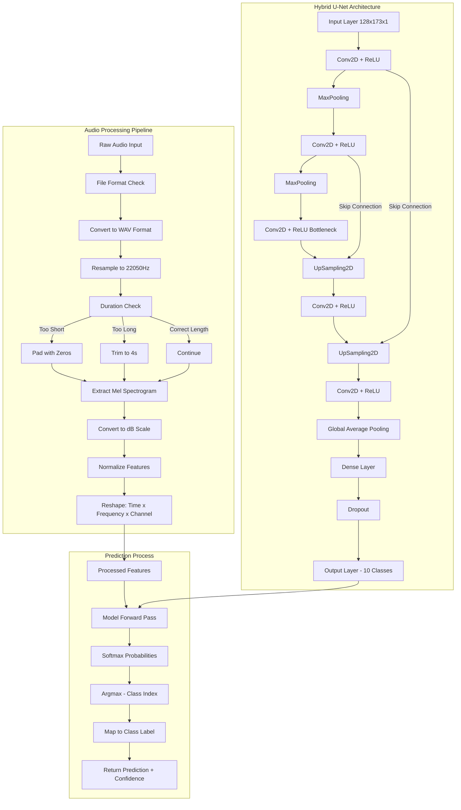
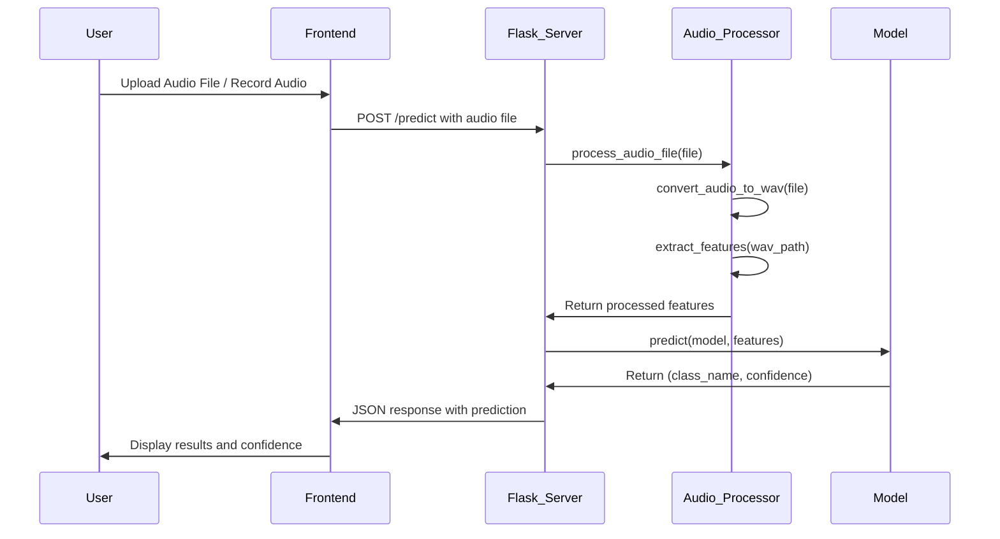
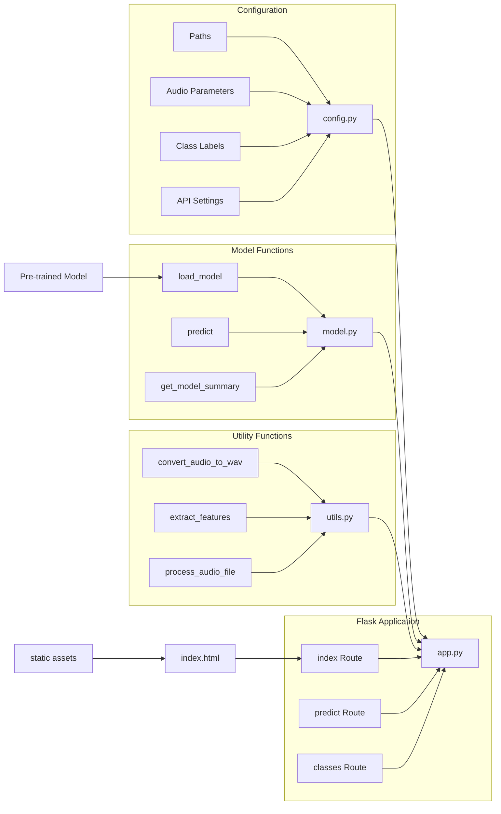
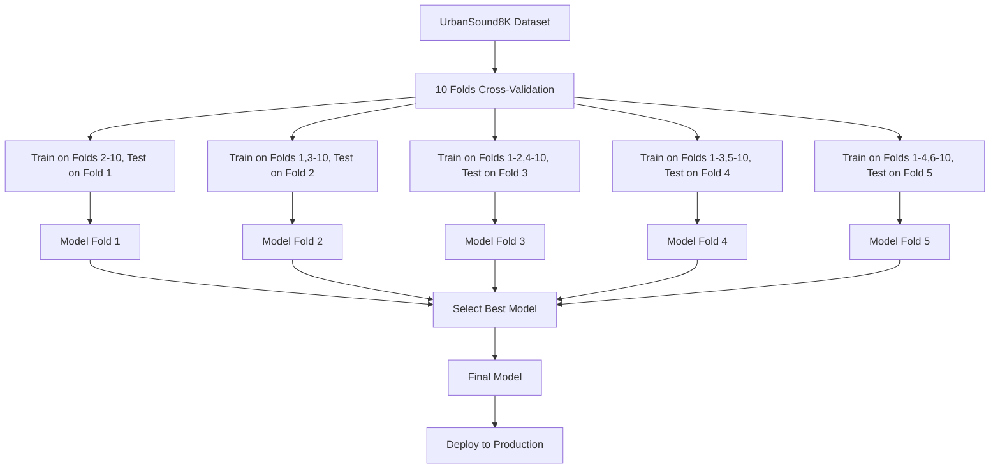
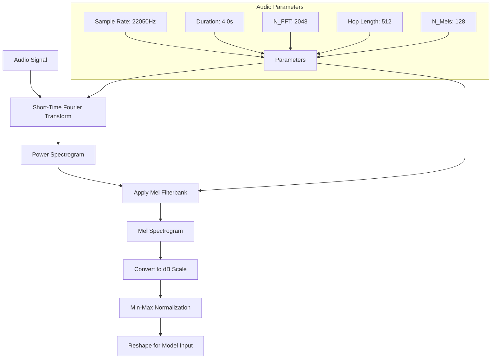

# Urban Sound Classifier - Technical Flowchart

## Data Processing and Model Architecture

## API Endpoints and Data Flow

## System Components Interaction

## Cross-Validation and Model Training

## Feature Extraction Detail

These flowcharts provide a comprehensive technical overview of the Urban Sound Classifier system, illustrating the data processing pipeline, model architecture, API interactions, cross-validation approach, and feature extraction details. The diagrams help visualize the complex relationships between different components and the flow of data through the system.