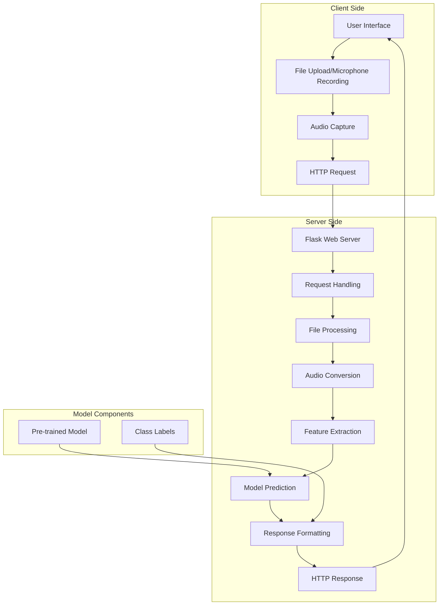
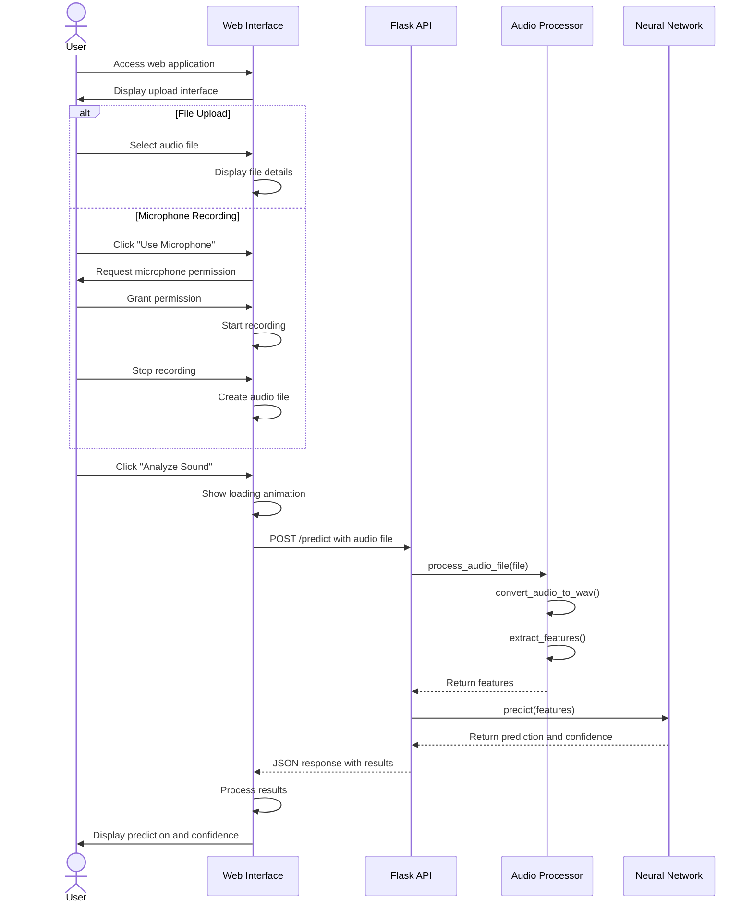
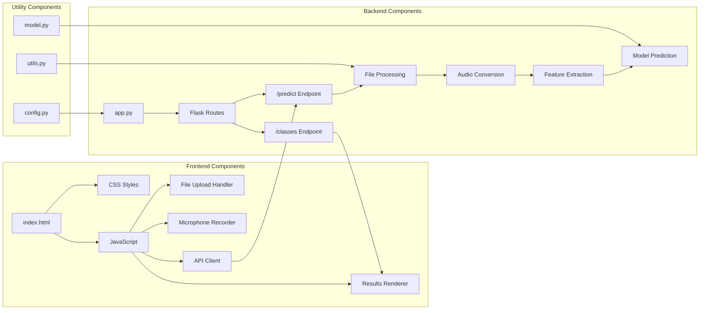
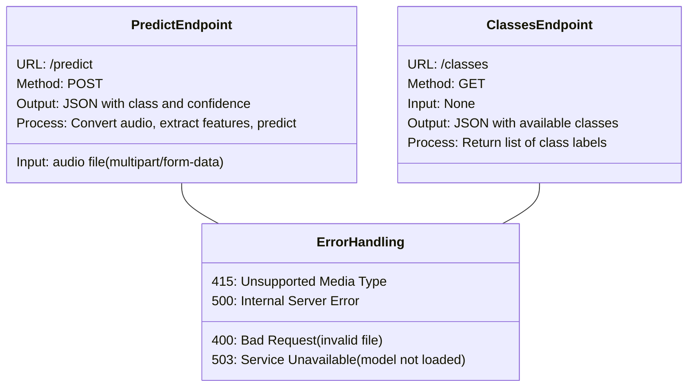
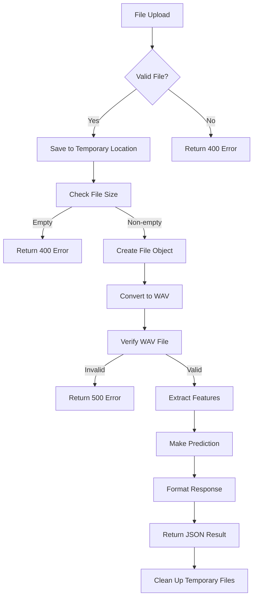
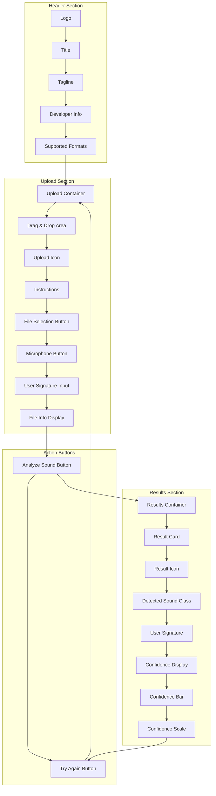
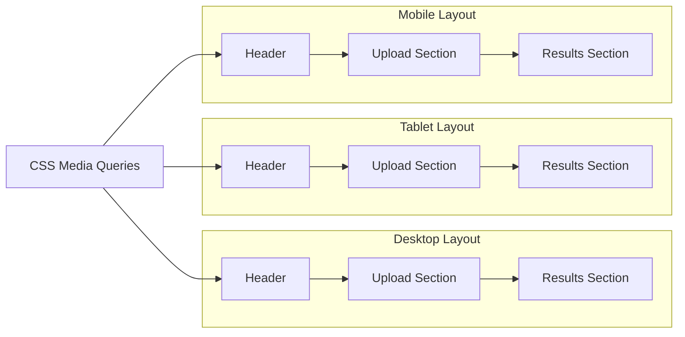
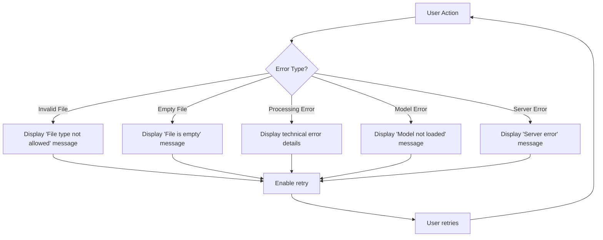
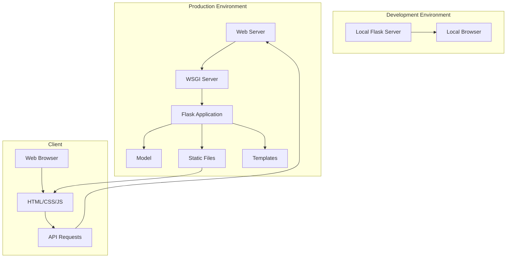

# Urban Sound Classifier - Web Application Architecture

## Application Architecture Overview

## User Interaction Flow

## Component Architecture

## API Endpoints

## File Processing Pipeline

## User Interface Components

## Responsive Design

## Error Handling Flow

## Deployment Architecture

These diagrams provide a comprehensive view of the Urban Sound Classifier's web application architecture, showing how the different components interact, the user flow through the application, and the technical implementation details of the frontend and backend systems. The visualizations help to understand the complete system from user interaction to model prediction and result presentation.